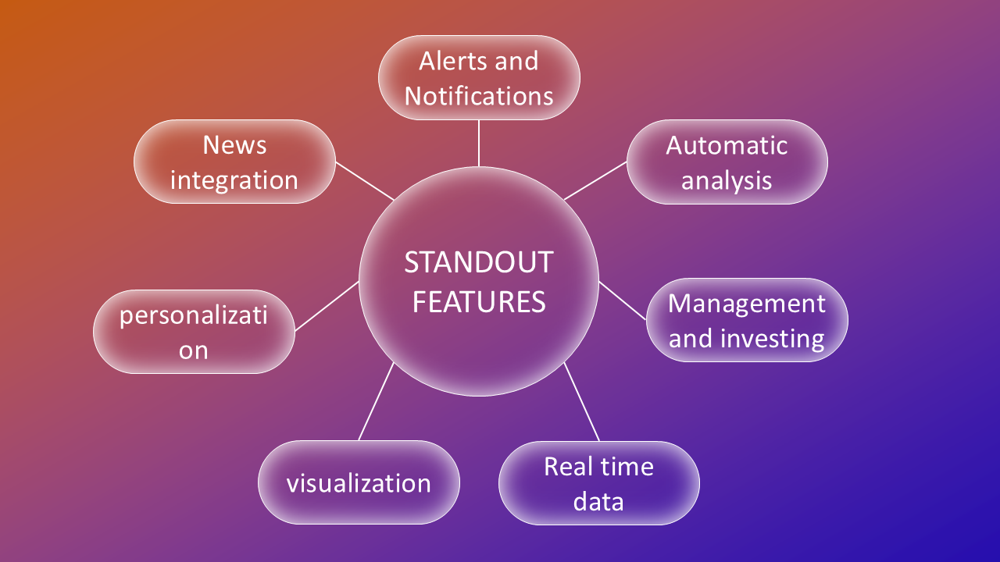

# INFIN - Comprehensive Financial Management App

## Team: SEEKERS
- **Team Leader:** Hanumanth Kumar
- **Team Members:** Manikanta Perumalla, Lohith Reddy

## Problem Statement
Many people struggle to manage their finances effectively, resulting in debt, missed payments, and a lack of savings. Existing budgeting and financial management apps may not meet all users' needs, lacking certain features and functionalities.

## Objective
Develop a comprehensive budgeting and financial management app that meets the needs of a diverse range of users. The app should:
- Provide a user-friendly interface for tracking expenses, managing investments, and setting savings goals.
- Incorporate machine learning models to predict spending patterns and provide personalized recommendations.
- Ensure data security and privacy by complying with relevant regulations and standards.
- Promote the app effectively to reach a large user base and achieve high adoption rates.

## Proposed Solution
Our proposed solution is **INFIN**, a comprehensive financial management app that helps users manage their expenses, savings, and investments more effectively. It uses machine learning for stock predictions and personalized financial advice, and it ensures secure data management.

## Features of INFIN
- **Alerts and Notifications**: Real-time alerts on stock trends and spending patterns.
- **Expense Management**: Track expenses, create budgets, and set savings goals.
- **Investment Management**: Provides stock market predictions and investment insights.
- **Personalization**: Personalized recommendations based on user data.
- **Data Security**: Ensures encryption of all user data and fraud detection.

## Standout Features
1. **Real-Time Data**: Provides up-to-date financial information and stock trends.
2. **Visualization**: Graphical representation of spending and investment habits.
3. **Automatic Analysis**: Machine learning-based predictions for better financial decisions.

## Tech Stack
- **Frontend**: ReactJS, HTML, CSS
- **Backend**: Python (for machine learning and stock predictions)
- **Database**: MySQL
- **Machine Learning Models**: Stock market predictions and spending pattern analysis

## Current Financial Management Challenges
1. Manually entering expenses
2. No real-time data or alerts
3. Difficulty tracking savings and investment trends
4. Lack of expert advice

## Solution Highlights
- **Automatic Financial Management**: The app automates many aspects of expense tracking and investment management.
- **Secure Data Handling**: Uses encryption and a privacy-focused approach to protect user data.
- **Fraud Detection**: Monitors user activity and flags any suspicious behavior.

## Achievements
Our team successfully pitched **INFIN** at the Ideathon, showcasing its potential to revolutionize personal financial management by providing intelligent insights and security features for users.

## Contact
For more information or inquiries, please contact pp2549@srmist.edu.in.
